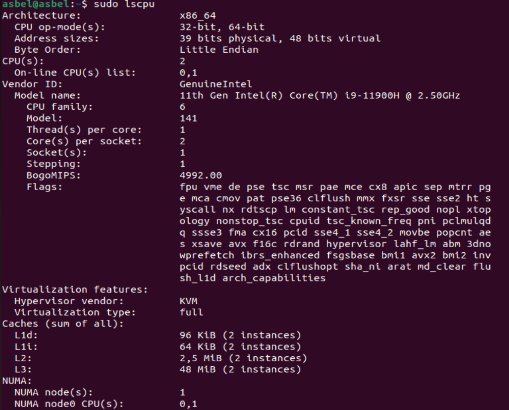
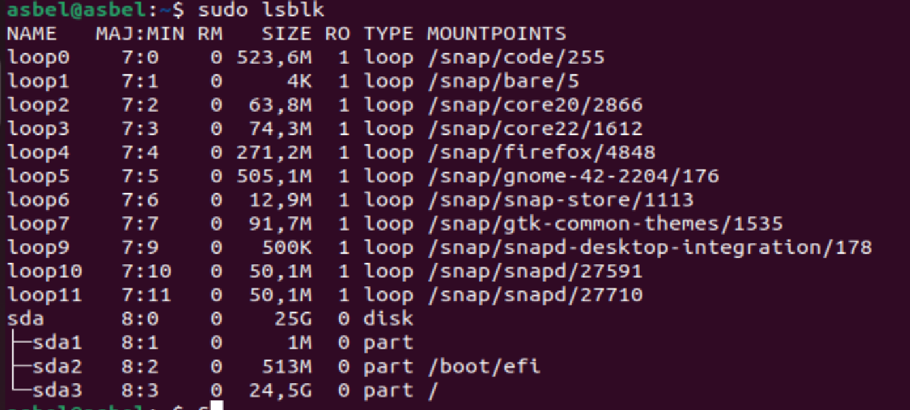
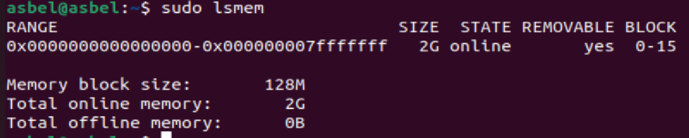
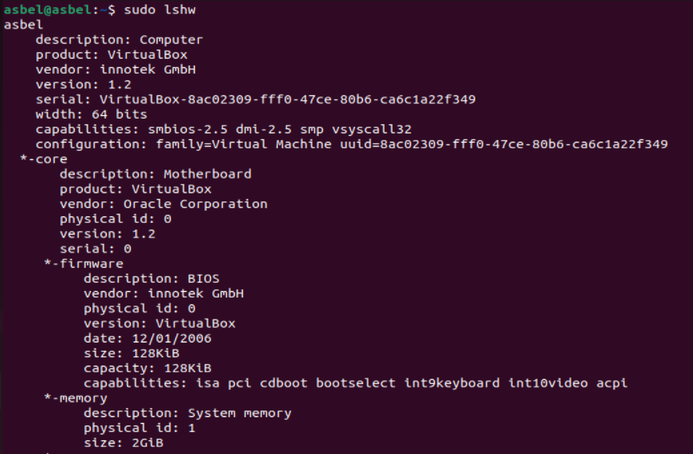
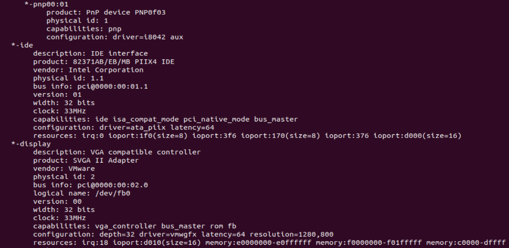
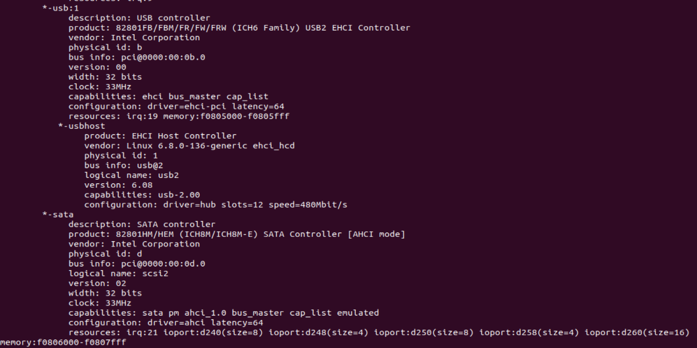
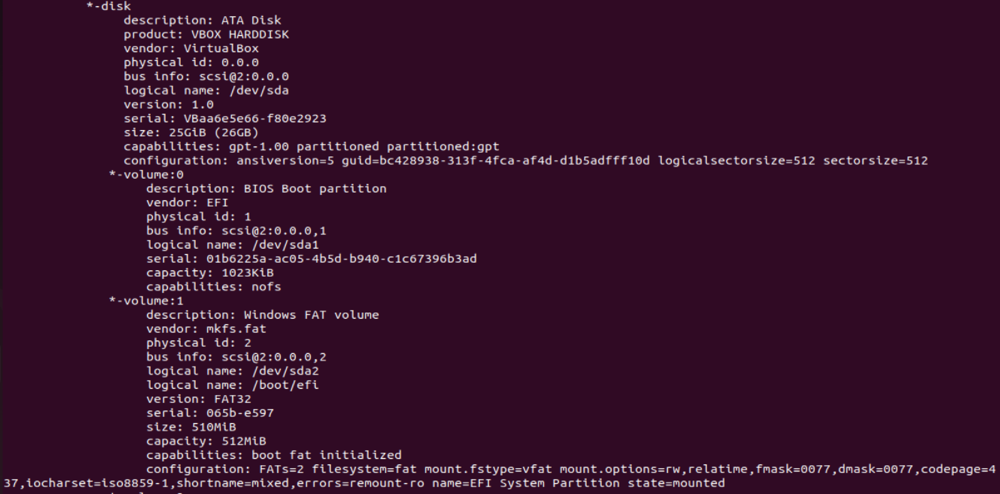
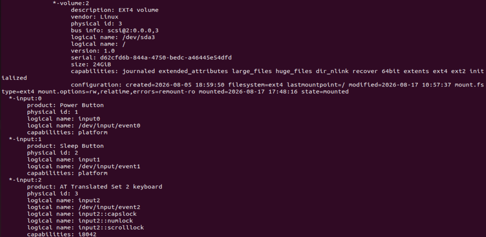

# Reporte sobre los comandos de diagnostico de Linux
## 1. Procesador
## lscpu:

Explicacion:
### Explicación de la Arquitectura del Procesador (Comando lscpu)
Especificaciones técnicas del procesador según los datos obtenidos de la terminal de Linux.
### 1. Arquitectura General y CPU
* **Architecture: x86_64**
  * Indica que el procesador utiliza la arquitectura de 64 bits de Intel/AMD (x86 de 64 bits).
* **CPU op-mode(s): 32-bit, 64-bit**
  * El procesador es capaz de ejecutar sistemas operativos y programas tanto de 32 bits como de 64 bits.
* **Address sizes: 39 bits physical, 48 bits virtual**
  * Define los límites de memoria. Puede direccionar físicamente hasta $2^{39}$ bytes de memoria RAM real y mapear hasta $2^{48}$ bytes en memoria virtual.
* **Byte Order: Little Endian**
  * Es el formato de almacenamiento en memoria. Significa que los bytes de menor peso (menos significativos) se guardan en las direcciones de memoria más bajas.
* **CPU(s): 2**
  * El sistema operativo ve y utiliza 2 núcleos de procesamiento lógicos en este entorno (común en máquinas virtuales configuradas con 2 CPUs).
* **On-line CPU(s) list: 0,1**
  * Los dos núcleos disponibles están activos y funcionando actualmente (identificados con los índices 0 y 1).

### 2. Información del Fabricante y Modelo
* **Vendor ID: GenuineIntel**
  * El fabricante real del procesador es Intel.
* **Model name: 11th Gen Intel(R) Core(TM) i9-11900H @ 2.50GHz**
  * Es el modelo comercial del chip: Un Intel Core i9 de 11ª generación para computadoras portátiles de alto rendimiento, con una frecuencia base de 2.50 gigahercios.
* **CPU family: 6**
  * Categoría interna que usa Intel para agrupar las microarquitecturas de sus procesadores modernos.
* **Model: 141**
  * El código numérico específico asignado por el fabricante para identificar el diseño exacto de este chip dentro de su familia.
* **Thread(s) per core: 1**
  * Cada núcleo físico ejecuta únicamente 1 hilo de procesamiento a la vez en este entorno virtualizado (el Hyper-Threading está desactivado o limitado por el hipervisor).
* **Core(s) per socket: 2**
  * Indica que hay 2 núcleos físicos asignados dentro del procesador de la máquina actual.
* **Socket(s): 1**
  * Solo hay 1 ranura o zócalo físico de CPU en la placa base de este sistema.
* **Stepping: 1**
  * Es el número de revisión del silicio del procesador. Funciona como una versión de hardware; el número 1 indica que es una de las primeras revisiones producidas.
* **BogoMIPS: 4992.00**
  * Una medida interna que usa el sistema operativo Linux al arrancar para calcular la velocidad de un reloj digital interno sin calibrar ("Bogus Million Instructions Per Second").

### 3. Banderas de Características (Flags)
* **Flags: fpu vme de pse tsc msr pae mce cx8 apic sep mtrr ...**
  * Es una lista exhaustiva de instrucciones de hardware soportadas por el procesador. Incluye tecnologías de cifrado (como `aes`), soporte multimedia y cálculo matemático avanzado (`sse4_1`, `avx`, `avx2`), y características de seguridad como `sha_ni`.

### 4. Virtualización
* **Hypervisor vendor: KVM**
  * Revela que este sistema operativo Linux corre dentro de una máquina virtual, y el programa encargado de gestionarla es KVM (Kernel-based Virtual Machine).
* **Virtualization type: full**
  * Virtualización completa. La máquina virtual tiene la ilusión de interactuar directamente con un hardware físico real completo, traduciendo las instrucciones de forma eficiente.

### 5. Memorias Caché (Caches)
* **L1d: 96 KiB (2 instances)**
  * Caché de Datos de Nivel 1. Cuenta con 2 bloques separados de 48 KiB (uno dedicado exclusivamente para cada núcleo).
* **L1i: 64 KiB (2 instances)**
  * Caché de Instrucciones de Nivel 1. Cuenta con 2 bloques separados de 32 KiB para almacenar las órdenes de ejecución antes de procesarlas.
* **L2: 2,5 MiB (2 instances)**
  * Caché de Nivel 2. Memoria intermedia ultra rápida repartida en dos instancias (1.25 MiB por núcleo).
* **L3: 48 MiB (2 instances)**
  * Caché de Nivel 3. Memoria de alta capacidad compartida, dividida en dos bloques grandes para acelerar el intercambio de datos pesados.

### 6. Arquitectura de Memoria (NUMA)
* **NUMA node(s): 1**
  * Significa que toda la memoria RAM del sistema se gestiona de manera centralizada bajo un único bloque de acceso uniforme.
* **NUMA node0 CPU(s): 0,1**
  * Confirma que las dos CPUs disponibles (0 y 1) están conectadas directamente y tienen los mismos tiempos de acceso al nodo de memoria principal 0.

### 7. Vulnerabilidades del Procesador (Vulnerabilities)
*Muestra el estado de seguridad del chip frente a fallos de diseño de hardware conocidos de los últimos años:*
* **Gather data sampling: Unknown: Dependent on hypervisor status**
  * El estado de esta vulnerabilidad depende de la configuración de seguridad que tenga la máquina física principal.
* **Indirect target selection: Mitigation; Aligned branch/return thunks**
  * El sistema está protegido activamente mediante parches de software aplicados a nivel de código.
* **Itlb multihit / Litf / Mds / Meltdown / Mmio stale data / Reg file data sampling: Not affected**
  * El procesador o el sistema operativo están completamente a salvo de estos tipos de ataques específicos; no presentan riesgo.
* **Retbleed: Mitigation; Enhanced IBRS**
  * Corregido mediante el uso de barreras de predicción indirecta mejoradas (IBRS por hardware).
* **Spec rstack overflow: Not affected**
  * No se ve afectado por desbordamientos de la pila de retorno especulativa.
* **Spec store bypass: Vulnerable**
  * Alerta de riesgo bajo este tipo de ataque; el hardware permite omitir de forma especulativa escrituras en memoria pendientes.
* **Spectre v1: Mitigation; usercopy/swapgs barriers and __user pointer sanitization**
  * Protegido mediante la desinfección de punteros del usuario y barreras de software en el núcleo.
* **Spectre v2: Mitigation; Enhanced / Automatic IBRS; PBRSB-eIBRS SW sequence; BHI SW loop, KVM SW loop**
  * Protegido mediante una combinación compleja de seguridad por hardware avanzado y bucles de control por software para entornos KVM.
* **Srbds / Tsa / Tsx async abort / Vmscape: Not affected**
  * Inmune a fallos en el bus de datos aleatorios, abortos asíncronos de extensiones transaccionales o escapes de aislamiento en la máquina virtual.

## 2. Buses y almacenamiento
## lspci:
### Explicación de los Dispositivos del Bus PCI (Comando lspci)
Controladores de hardware y periféricos conectados a la placa base a través del bus informático PCI, detectados en este entorno virtual.

### 1. Formato de Direccionamiento de la Izquierda (`00:xx.x`)
Los números iniciales representan la ubicación exacta del dispositivo en el bus usando la nomenclatura **Bus:Dispositivo.Función** (Domain:Bus:Device.Function). 
* Todos empiezan con `00:` porque están conectados en el bus principal (Bus 0).

---

### 2. Desglose de cada Dispositivo de Hardware

* **00:00.0 Host bridge: Intel Corporation 440FX - 82441FX PMC [Natoma] (rev 02)**
  * **Puente Norte (Northbridge):** Es el chip principal que comunica el procesador (CPU) con la memoria RAM y el bus de datos de alta velocidad. El modelo emulado aquí es un clásico chip de Intel (`440FX`).
* **00:01.0 ISA bridge: Intel Corporation 82371SB PIIX3 ISA [Natoma/Triton II]**
  * **Puente Sur (Southbridge):** Chip encargado de controlar los componentes más lentos de la placa base, como los puertos antiguos, temporizadores e interrupciones del sistema utilizando la arquitectura clásica ISA.
* **00:01.1 IDE interface: Intel Corporation 82371AB/EB/MB PIIX4 IDE (rev 01)**
  * **Controladora IDE:** Interfaz heredada utilizada antiguamente para conectar discos duros y lectoras de CD/DVD mediante cables planos de cinta.
* **00:02.0 VGA compatible controller: VMware SVGA II Adapter**
  * **Tarjeta Gráfica (Video):** Controlador de video que maneja la salida de pantalla. Al decir `VMware SVGA II`, revela técnicamente que la máquina virtual está configurada o hereda la compatibilidad de pantalla de controladores gráficos virtualizados estándar.
* **00:03.0 Ethernet controller: Intel Corporation 82540EM Gigabit Ethernet Controller (rev 02)**
  * **Tarjeta de Red:** Interfaz de red cableada (LAN). Emula una tarjeta física Intel capaz de transferir datos a velocidades de hasta 1 Gigabit por segundo (1000 Mbps).
* **00:04.0 System peripheral: InnoTek Systemberatung GmbH VirtualBox Guest Service**
  * **Componente de Virtualización:** Esta línea es la prueba definitiva de que estás usando **VirtualBox** (InnoTek fue la empresa creadora original antes de ser comprada por Sun/Oracle). Representa los servicios de integración del sistema ("Guest Additions") que permiten compartir el portapapeles o redimensionar la pantalla.
* **00:05.0 Multimedia audio controller: Intel Corporation 82801AA AC'97 Audio Controller (rev 01)**
  * **Tarjeta de Sonido:** Controlador de audio del sistema que emula el antiguo pero muy compatible estándar AC'97 de Intel para procesar entradas y salidas de audio.
* **00:06.0 USB controller: Apple Inc. KeyLargo/Intrepid USB**
  * **Controlador USB Integrado:** Un chip controlador USB de baja velocidad emulado para dotar de soporte inicial a dispositivos de entrada comunes (como el teclado o el mouse de la máquina virtual).
* **00:07.0 Bridge: Intel Corporation 82371AB/EB/MB PIIX4 ACPI (rev 08)**
  * **Controlador de Energía (ACPI):** Componente de hardware encargado de gestionar las funciones de ahorro de energía, estados de suspensión y el apagado automático del sistema operativo.
* **00:0b.0 USB controller: Intel Corporation 82801FB/FBM/FR/FW/FRW (ICH6 Family) USB2 EHCI Controller**
  * **Controlador USB 2.0:** Controlador USB de alta velocidad (`EHCI`). Se encarga de gestionar los puertos y periféricos USB modernos que conectas a la máquina virtual con velocidades mejoradas.
* **00:0d.0 SATA controller: Intel Corporation 82801HM/HEM (ICH8M/ICH8M-E) SATA Controller [AHCI mode] (rev 02)**
  * **Controladora de Disco SATA:** Es el puente que maneja los discos duros modernos. Trabaja bajo el protocolo avanzado `AHCI`, que es el que permite comunicar el sistema operativo con la partición raíz (`sda`) que vimos en la pantalla anterior.

## lsblk:
### Explicación de los Dispositivos de Almacenamiento (Comando lsblk)
Estructura de los discos, particiones y dispositivos virtuales activos en el sistema Linux.
### 1. Significado de las Columnas (Cabecera)
* **NAME**: Nombre asignado por el sistema al dispositivo de bloque (discos, particiones o bucles virtuales).
* **MAJ:MIN**: Números Mayor y Minor asignados por el núcleo de Linux para identificar el tipo de controlador de hardware (ej. `8` para discos SCSI/SATA) y el número específico de dispositivo.
* **RM (Read-Most / Removable)**: Indica si el dispositivo es extraíble. Un `0` significa que es un disco fijo (como un disco duro interno) y un `1` indicaría un pendrive o lectora de CD.
* **SIZE**: Capacidad de almacenamiento total que posee el elemento en megabytes (M) o gigabytes (G).
* **RO (Read-Only)**: Indica si es de solo lectura. Un `1` significa que está protegido y no se puede modificar; un `0` significa que permite lectura y escritura.
* **TYPE**: Tipo de dispositivo de bloque (`disk` para discos físicos, `part` para particiones lógicas, y `loop` para dispositivos virtuales basados en archivos).
* **MOUNTPOINTS**: El punto de montaje en el sistema de archivos de Linux. Indica en qué carpeta se accede al contenido de ese dispositivo.

---

### 2. Dispositivos Virtuales (Dispositivos Loop)
*Los elementos del `loop0` al `loop11` son pseudo-dispositivos virtuales. Ubuntu los utiliza para montar paquetes de software aislados usando la tecnología **Snap**.*

* **loop0 a loop11 (TYPE: loop, RO: 1)**
  * Son archivos empaquetados comprimidos que actúan como "discos virtuales independientes" de Solo Lectura (`RO=1`).
  * Cada uno contiene una aplicación específica aislada con sus librerías para que no interfiera con el resto del sistema operativo.
  * **Ejemplos destacados en la imagen:**
    * `loop0`: Entorno de desarrollo **VS Code** (`/snap/code/255`).
    * `loop4`: Navegador web **Firefox** (`/snap/firefox/4848`).
    * `loop6`: Tienda de aplicaciones de Ubuntu **Snap Store** (`/snap/snap-store/1113`).
    * `loop5` y `loop7`: Librerías gráficas y de interfaz para el escritorio **Gnome** y temas visuales **GTK**.

---

### 3. Disco Físico y Particiones Reales (Dispositivo sda)
*Este es el almacenamiento real de la computadora (o disco virtual asignado a la máquina virtual).*

* **sda (MAJ:MIN 8:0, SIZE: 25G, TYPE: disk)**
  * Representa el primer disco duro de tipo SCSI, SATA o virtualizado (`sda`). Tiene un tamaño total de **25 Gigabytes** y es un disco fijo no extraíble (`RM=0`).

* **sda1 (SIZE: 1M, TYPE: part)**
  * Es la primera partición del disco con apenas 1 Megabyte de tamaño. No tiene punto de montaje. Se usa comúnmente en tablas de particiones GPT para alojar el código de arranque inicial (BIOS boot partition).

* **sda2 (SIZE: 513M, TYPE: part, MOUNTPOINT: /boot/efi)**
  * Es la partición del sistema **EFI (Extensible Firmware Interface)**. Contiene los cargadores de arranque necesarios para que la computadora inicie el sistema operativo de forma segura.

* **sda3 (SIZE: 24,5G, TYPE: part, MOUNTPOINT: /)**
  * Es la partición principal de Linux. Está montada en la raíz del sistema (`/`). Contiene absolutamente todo el sistema operativo, tus carpetas de usuario, configuraciones y programas instalados fuera de Snap.

## 3. Memoria y sistema
## lsmem:
## Explicación del Estado de la Memoria RAM (Comando lsmem)

Organización, el direccionamiento físico y la división en bloques de la memoria RAM disponible en el sistema.

### 1. Desglose de la Tabla de Rangos de Memoria
* **RANGE: 0x0000000000000000-0x0000000007ffffff**
  * Representa las direcciones físicas inicial y final de la memoria RAM expresadas en sistema hexadecimal. Ese rango exacto abarca desde el byte 0 hasta el byte número 2,147,483,647.
* **SIZE: 2G**
  * Es la cantidad de memoria contenida en el rango de direcciones anterior: exactamente **2 Gigabytes** de memoria RAM.
* **STATE: online**
  * Indica el estado operativo de este rango de memoria. "Online" significa que está activa, disponible y siendo utilizada por el núcleo (kernel) de Linux.
* **REMOVABLE: yes**
  * Indica si este bloque de memoria soporta la desconexión en caliente (Hot-Unplug). Al estar en un entorno virtualizado, el sistema operativo permite "quitar" o reducir dinámicamente este tramo de RAM sin apagar la máquina.
* **BLOCK: 0-15**
  * Muestra los identificadores numéricos de los bloques lógicos asignados a este rango (desde el bloque 0 hasta el bloque 15, sumando un total de 16 bloques).

---

### 2. Métricas de Organización del Sistema
* **Memory block size: 128M**
  * Es el tamaño fijo de cada sección o bloque en el que Linux divide la memoria RAM para administrarla a bajo nivel. Si multiplicas los 16 bloques (`0-15`) por sus `128M` cada uno, da como resultado exacto los `2G` totales.
* **Total online memory: 2G**
  * El total absoluto de memoria RAM que el sistema operativo tiene a su disposición en este momento para ejecutar procesos.
* **Total offline memory: 0B**
  * Indica que no hay bloques de memoria RAM inactivos o reservados fuera de línea. Toda la capacidad asignada está siendo aprovechada.

## lshw:
### Explicación del Hardware del Sistema (Comando lshw)

Jerarquía de hardware de la computadora, organizada en un árbol de nodos que describe los componentes principales y sus capacidades integradas.

### 1. Nodo Raíz (Información General del Sistema)
* **asbel** *(Línea inicial del nodo)*
  * Es el nombre identificador asignado al nodo principal del equipo.
* **description: Computer**
  * Describe el tipo de dispositivo general que se está analizando.
* **product: VirtualBox / vendor: innotek GmbH**
  * Confirma que el sistema se ejecuta en un entorno virtualizado creado por VirtualBox (originalmente desarrollado por innotek GmbH).
* **version: 1.2 / serial: VirtualBox-8ac02309...**
  * Versión del producto emulado y número de serie único generado aleatoriamente para esta máquina virtual.
* **width: 64 bits**
  * La arquitectura base del sistema informático es de 64 bits.
* **capabilities: smbios-2.5 dmi-2.5 smp vsyscall32**
  * Características soportadas por la placa, como la estructura de gestión de información SMBIOS/DMI y multiprocesamiento simétrico (`smp`).
* **configuration: family=Virtual Machine...**
  * Clasifica el entorno como una máquina virtual y le asigna su identificador único universal (UUID).

---

### 2. Placa Base y Firmware (`*-core`)
* ***-core (description: Motherboard)**
  * Representa la placa base (tarjeta madre) virtual del sistema, provista en este caso bajo la firma actual de Oracle Corporation.
* ***-firmware (description: BIOS)**
  * **BIOS del Sistema:** Es el firmware encargado del arranque del equipo. 
  * Tiene un tamaño de almacenamiento asignado de `128KiB` y una fecha de compilación del `12/01/2006` (fecha estándar usada en la emulación de VirtualBox).
  * **capabilities:** Soporta buses antiguos ISA, periféricos PCI, arranque desde CD-ROM (`cdboot`), selección de dispositivo de arranque (`bootselect`) y administración de energía (`acpi`).

---

### 3. Memoria Principal (`*-memory`)
* **description: System memory**
  * Identifica el banco de memoria RAM principal del equipo.
* **physical id: 1**
  * Dirección de identificación física asignada a este módulo dentro de la placa base.
* **size: 2GiB**
  * Capacidad total de memoria de acceso aleatorio (RAM) disponible en el sistema (2 Gigabytes).

---

### 4. Procesador (`*-cpu`)
* **product: 11th Gen Intel(R) Core(TM) i9-11900H @ 2.50GHz**
  * Microprocesador que da soporte a la máquina: Un procesador de alta gama Intel Core i9 de 11ª generación.
* **bus info: cpu@0**
  * Ubicación física del procesador dentro del zócalo de la placa (Zócalo de CPU 0).
* **capabilities: fpu fpu_exception wp vme de pse tsc msr...**
  * Lista detallada de todas las instrucciones por hardware que hereda la CPU. Incluye soporte para operaciones matemáticas complejas (`fpu`), tecnologías de virtualización (`vmx`), extensiones multimedia avanzadas (`sse`, `avx2`) y aceleración criptográfica (`sha_ni`).

---

### 5. Arquitectura Interna de Buses (`*-pci`)
* ***-pci (description: Host bridge)**
  * El controlador central de la placa base (Puente Norte / Intel 440FX). Se encarga de interconectar la CPU con los componentes de máxima velocidad operando a un reloj base de 33MHz.

#### Subnodo de Dispositivos Heredados (`*-isa`)
* ***-isa (description: ISA bridge)**
  * El Puente Sur (Intel PIIX3). Administra los componentes secundarios o de menor velocidad del sistema.
* ***-pnp00:00 (product: PnP device PNP0303)**
  * **Dispositivo Plug and Play:** Es un subnodo de control automático que gestiona periféricos integrados de entrada de datos (`driver=i8042 kbd`), que corresponde al controlador clásico del teclado de la máquina virtual.
### 6. Dispositivos Heredados y Almacenamiento IDE
* ***-pnp00:01 (product: PnP device PNP0f03)**
  * **Dispositivo Plug and Play:** Administrado por el controlador auxiliar `driver=i8042 aux`. En la arquitectura de PC, corresponde al puerto clásico de mouse PS/2 integrado en la placa base virtual.
* ***-ide (description: IDE interface)**
  * **Controladora IDE Intel PIIX4:** Chipset encargado de la transferencia de datos con unidades de almacenamiento en bus paralelo. 
  * Trabaja a una velocidad de reloj de `33MHz` con un ancho de banda de bus de `32 bits`. 
  * Sus recursos muestran los puertos de Entrada/Salida mapeados (ej. `ioport:1f0`) y las líneas de interrupción asignadas para comunicarse con el procesador.

---

### 7. Controlador de Gráficos y Pantalla (`*-display`)
* **description: VGA compatible controller**
  * Tarjeta de video del sistema encargada de procesar las imágenes y la interfaz gráfica de usuario.
* **product: SVGA II Adapter / vendor: VMware**
  * Modelo de adaptador gráfico emulado para brindar soporte de aceleración y visualización en pantallas virtuales.
* **logical name: /dev/fb0**
  * Archivo especial en Linux que representa el *Framebuffer* principal, permitiendo al sistema operativo escribir píxeles directamente en la memoria de video.
* **configuration: depth=32 resolution=1280,800 ...**
  * Muestra los parámetros de renderizado actuales: una paleta de color de 32 bits de profundidad y una resolución de pantalla establecida en 1280x800 píxeles a través del controlador `vmwgfx`.
* **resources:** Lista los rangos de direcciones de memoria RAM de video (`memory:e0000000...`) reservados exclusivamente para almacenar las texturas y fotogramas de la interfaz.

---

### 8. Interfaz de Red de Datos (`*-network`)
* **description: Ethernet interface**
  * Tarjeta de red física virtualizada para dotar de conectividad a la máquina.
* **product: 82540EM Gigabit Ethernet Controller / vendor: Intel Corporation**
  * Chipset de red emulado de Intel de alto rendimiento, que opera en un bus de `32 bits` a una frecuencia de `66MHz`.
* **logical name: enp0s3**
  * El nombre oficial de la interfaz de red asignado por el kernel de Linux basado en su ubicación en el bus PCI (Bus 0, Dispositivo 3).
* **serial: 08:00:27:bb:0c:5a**
  * Dirección física MAC única de la tarjeta de red, utilizando el prefijo de fabricante `08:00:27` asignado a los adaptadores de red de Oracle/VirtualBox.
* **size: 1Gbit/s / capacity: 1Gbit/s**
  * Velocidad de transmisión actual y máxima soportada por la interfaz (Red Gigabit de 1000 Mbps).
* **capabilities: pm pcix bus_master ... autonegotiation**
  * Tecnologías de red activas, incluyendo negociación automática de velocidad y soporte para múltiples velocidades de cableado duplex (`10bt`, `100bt`, `1000bt`).
* **configuration: ip=10.0.2.15 ...**
  * Configuración lógica de red de Linux. Indica que la máquina virtual tiene asignada la dirección IP local `10.0.2.15` provista por el servicio de red interna (NAT) del hipervisor.

---

### 9. Periférico de Integración Genérico (`*-generic`)
* **description: System peripheral**
  * Periférico interno del sistema de propósito especial.
* **product: VirtualBox mouse integration / vendor: InnoTek Systemberatung GmbH**
  * Controlador interno específico que permite sincronizar de forma fluida el mouse de tu computadora física con el de la máquina virtual (evitando tener que presionar teclas como Ctrl para liberar el cursor).
* **logical name: /dev/input/mouse2 / /dev/input/event6**
  * Rutas asignadas en Linux para procesar los eventos físicos y señales de movimiento que envía este dispositivo de integración.
* **configuration: driver=vboxguest**
  * Confirma el uso del software de integración "VirtualBox Guest Additions" en el núcleo del sistema operativo.
### 10. Dispositivo de Sonido (`*-multimedia`)
* **description: Multimedia audio controller**
  * Tarjeta de sonido integrada encargada de procesar las señales de entrada y salida de audio del sistema operativo.
* **product: 82801AA AC'97 Audio Controller / vendor: Intel Corporation**
  * Modelo de tarjeta de audio emulada de Intel que implementa la arquitectura clásica AC'97 (Audio Codec '97), ampliamente compatible con la mayoría de sistemas operativos.
* **bus info: pci@0000:00:05.0**
  * Ubicación exacta en el bus de la placa base: se encuentra mapeada en el Bus PCI 0, Dispositivo 5, Función 0.
* **logical name: card0 / /dev/snd/controlC0 / /dev/snd/pcmC0D0c...**
  * Rutas y archivos lógicos lógicos creados por ALSA (Advanced Linux Sound Architecture). 
  * `controlC0`: Permite controlar el volumen y los canales.
  * `pcmC0D0c` y `pcmC0D0p`: Gestionan la captura (grabación) y la reproducción física del flujo de audio digital.
* **width: 32 bits / clock: 33MHz**
  * El controlador opera con un ancho de bus de datos de 32 bits y una velocidad de sincronización de reloj de 33 Megahercios.
* **configuration: driver=snd_intel8x0**
  * Muestra el módulo o controlador del Kernel de Linux que se está ejecutando para dar soporte de software a este hardware específico.
* **resources: irq:21 ioport:d100...**
  * Asigna la línea de interrupción de hardware número 21 (`irq:21`) para alertar al procesador principal y define las direcciones de puertos de entrada/salida (`d100` y `d200`) para el intercambio de datos.

---

### 11. Controlador de Bus Serie Universal (`*-usb:0`)
* **description: USB controller**
  * Concentrador (Host Controller) encargado de gestionar la comunicación y transferencia con los periféricos USB conectados.
* **product: KeyLargo/Intrepid USB / vendor: Apple Inc.**
  * Chipset de bus USB virtualizado basado originalmente en la arquitectura de Apple. Proporciona soporte de compatibilidad básica para ratones y teclados en entornos emulados.
* **physical id: 6 / bus info: pci@0000:00:06.0**
  * Dirección física asignada en la placa número 6 y mapeada en el Bus PCI 0, Dispositivo 6, Función 0.
* **width: 32 bits / clock: 33MHz**
  * Opera de forma estándar con un ancho de bus de 32 bits y una velocidad de frecuencia interna de 33MHz.
* **capabilities: ohci bus_master cap_list**
  * `ohci` (Open Host Controller Interface): Indica que implementa el estándar USB 1.1 para dispositivos de baja y velocidad completa (teclados, mouses).
  * `bus_master`: Permite al dispositivo interactuar directamente con la memoria del sistema sin intermediación constante del procesador.
* **configuration: driver=ohci-pci**
  * Utiliza el controlador universal del Kernel de Linux para controladores de tipo OHCI montados sobre un bus PCI.
* **resources: irq:22 memory:f0804000-f0804fff**
  * Utiliza la línea de interrupción número 22 (`irq:22`) y reserva una porción de memoria mapeada en el rango hexadecimal indicado para gestionar de manera rápida los búferes de los puertos USB.
### 12. Concentrador USB Raíz y Dispositivo de Interfaz (`*-usbhost` / `*-usb`)
* ***-usbhost (product: OHCI PCI host controller)**
  * **Controlador USB 1.1:** Concentrador de nivel de software administrado directamente por el driver del Kernel de Linux (`ohci_hcd`). 
  * Tiene una capacidad de `slots=12` (permite conectar virtualmente hasta 12 dispositivos) y opera a una velocidad baja de `12Mbit/s`.
* ***-usb (product: VirtualBox USB Tablet)**
  * **Dispositivo de Interfaz Humana (HID):** Es un dispositivo conectado internamente a ese controlador USB (`usb@1:1`).
  * VirtualBox emula una tableta digitalizadora en lugar de un mouse estándar para permitir que el cursor físico de tu sistema anfitrión se mueva de forma absoluta y fluida dentro de la ventana de Linux.
  * **configuration: maxpower=100mA speed=12Mbit/s**
    * Muestra el consumo de energía emulado (100 miliamperios) y que trabaja bajo la especificación del estándar USB 1.1.

---

### 13. Puente de Administración de Energía (`*-bridge`)
* **description: Bridge / product: 82371AB/EB/MB PIIX4 ACPI**
  * **Puente ACPI de Intel:** Un componente del Puente Sur encargado de todas las funciones de administración de energía, control térmico y estados de suspensión o apagado del hardware.
* **bus info: pci@0000:00:07.0**
  * Se encuentra mapeado en el bus PCI principal en la dirección lógica del Dispositivo 7, Función 0.
* **configuration: driver=piix4_smbus**
  * Utiliza el controlador del sistema para el bus de administración del sistema (SMBus), un bus de dos hilos derivado de I2C que supervisa el estado de los componentes de la placa base.
* **resources: irq:9**
  * Utiliza la línea de interrupción número 9 (`irq:9`) para enviar alertas de eventos de energía directamente a la CPU.

---

### 14. Controlador USB de Alta Velocidad (`*-usb:1`)
* **description: USB controller / product: 82801FB... USB2 EHCI Controller**
  * **Controlador USB 2.0:** A diferencia del primer controlador, este implementa el estándar `ehci` (Enhanced Host Controller Interface).
  * Soporta altas velocidades de transferencia en el bus de datos y mapea un subnodo `*-usbhost` con capacidad de `slots=12` pero operando a una velocidad muy superior de **`480Mbit/s`** (`speed=480Mbit/s`).

---

### 15. Controladora de Almacenamiento Principal (`*-sata`)
* **description: SATA controller / product: 82801HM/HEM... SATA Controller [AHCI mode]**
  * **Controladora de Discos SATA:** Es el chip emulado de Intel que sirve de puente para comunicar la placa madre con los discos de almacenamiento masivo.
* **configuration: driver=ahci**
  * Utiliza la interfaz de controlador de host avanzada (`AHCI`), que permite funciones nativas avanzadas de intercambio de datos con los discos rígidos.
* **logical name: scsi2**
  * El kernel de Linux gestiona este controlador mapeándolo internamente a través del subsistema lógico SCSI (con el identificador numérico 2).
* **resources: irq:21 ioport:d240...**
  * Comparte la línea de interrupción número 21 con el controlador de audio y reserva múltiples rangos de puertos de entrada/salida (`d240`, `d248`, `d250`, etc.) para gestionar el flujo masivo de lectura y escritura de tus particiones lógicas (`sda`).
### 16. Unidad de Disco Principal (`*-disk`)
* **description: ATA Disk / product: VBOX HARDDISK**
  * Representa el disco duro físico conectado a la máquina virtual. Al ser un entorno emulado, el producto se etiqueta directamente como un disco duro de VirtualBox.
* **logical name: /dev/sda**
  * Nombre de ruta lógica que asigna Linux para el acceso general a todo el almacenamiento del disco.
* **size: 25GiB (26GB)**
  * Capacidad total del disco duro asignado a esta máquina virtual.
* **capabilities: gpt-1.00 partitioned partitioned:gpt**
  * Indica que el disco está inicializado utilizando una tabla de particiones **GPT** (GUID Partition Table) moderna, reemplazando al antiguo estándar MBR.

---

### 17. Desglose de Volúmenes y Particiones (`*-volume`)

* ***-volume:0 (description: BIOS Boot partition)**
  * **Partición `/dev/sda1`:** Una partición muy pequeña de tan solo `1023KiB` (aproximadamente 1 Megabyte). No tiene sistema de archivos y se reserva únicamente para almacenar el cargador de arranque en sistemas GPT.
* ***-volume:1 (description: Windows FAT volume)**
  * **Partición `/dev/sda2`:** Formateada bajo el sistema de archivos **FAT32** con un tamaño de `510MiB`.
  * **logical name: /boot/efi / capabilities: boot fat initialized**
    * Es la partición del sistema **EFI**. Linux la monta de forma obligatoria en la ruta `/boot/efi` para gestionar de forma segura los archivos que permiten el arranque inicial del sistema operativo.
* ***-volume:2 (description: EXT4 volume)**
  * **Partición `/dev/sda3`:** El volumen principal del sistema con un tamaño de `24GiB`.
  * **logical name: / / vendor: Linux / version: 1.0**
    * Está formateada con el sistema de archivos nativo de Linux **EXT4**. Su punto de montaje es la raíz (`/`), guardando el núcleo, las aplicaciones y todas tus carpetas personales.
  * **configuration: created=2026-08-05 ... modified=2026-08-17 mount.fstype=ext4**
    * Registra los metadatos de montaje e historial. Muestra la fecha exacta de su creación y la última modificación o sincronización registrada en el sistema de archivos.

---

### 18. Botones e Interfaces del Chasis (`*-input`)

* ***-input:0 (product: Power Button) / *-input:1 (product: Sleep Button)**
  * **Botones de Energía y Suspensión:** Interfaces lógicas virtuales vinculadas al sistema de ACPI. Permiten que cuando presionas "Cerrar" o "Pausar" en la ventana de VirtualBox, el sistema operativo Linux reciba la orden y se apague o suspenda de forma limpia.
* ***-input:2 (product: AT Translated Set 2 keyboard)**
  * **Teclado Estándar:** Emulación de un teclado clásico tipo AT conectado mediante el controlador de hardware `i8042`. Sus propiedades activas administran funciones esenciales como las luces de bloqueo (`capslock`, `numlock`, `scrolllock`).
* ***-input:3 (product: Video Bus)**
  * Interfaz lógica encargada de capturar y mapear las señales o eventos de video del monitor emulado a las rutas internas del sistema (`/dev/input/event3`).
* ***-input:4 (product: IMExPS/2 Generic Explorer Mouse)**
  * **Ratón Genérico Explorer:** Emulación estándar de un mouse clásico conectado por un puerto PS/2 a través del bus `i8042`. Administra las señales básicas de movimiento y clics en la ruta interna `/dev/input/mouse0`.

